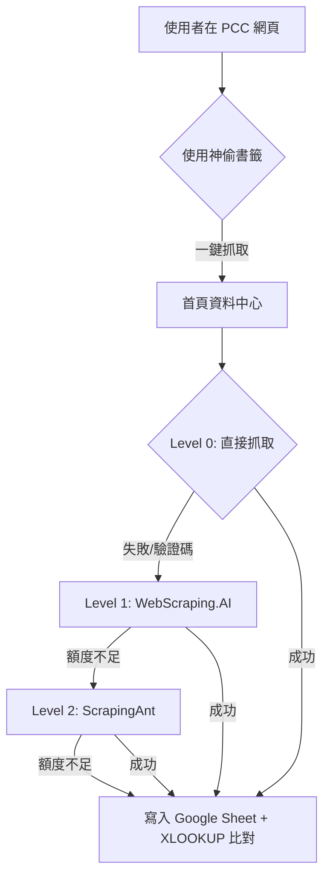

# 🏢 HILTI 招標資料採集中心 - 究極操作手冊 (V35)

這份手冊旨在導引 HILTI 同仁如何高效使用、監控並故障排除本自動化招標採集系統。

---

## 🧭 快速目錄
1. [系統架構圖解](#-系統架構圖解)
2. [獲取資料：神偷書籤教學](#-獲取資料神偷書籤教學)
3. [監控中心：數據顯示盤解讀](#-監控中心數據顯示盤解讀)
4. [核心備援邏輯 (Fallback)](#-核心備援邏輯-fallback)
5. [常見 Q&A 與故障排除](#-常見-qa-與故障排除)

---

## 🛠️ 系統架構圖解

本系統採用「前端採集 + 後端自動備援」的雙層架構，確保抓取成功率趨近 100%。

---

## 📑 獲取資料：神偷書籤教學

本工具採用由瀏覽器直接送出乾淨資料的「神偷模式 (Stealth Mode)」，可完美避開網站對 API 的偵測。

### 步驟說明：
1.  **進入目標網頁**：在政府電子採集網搜尋標案，進入標案的「詳細資訊」頁面。
2.  **啟動書籤**：點擊瀏覽器書籤列上的 **「神偷預先排查」** 或 **「光速抓取」**。
3.  **自動傳輸**：書籤會自動提取網頁內容，並透過 `navigator.clipboard` 處理後送往資料中心。
4.  **結果確認**：回到 HILTI 資料中心，左下角的「日誌紀錄」會顯示當下是透過哪組 API 或是「免費抓取」成功的。

---

## 📊 監控中心：數據顯示盤解讀

儀表板 (Dashboard) 提供 API 健康狀態的一眼掃描：

### 1. 進度環顏色定義 (智能警報)
*   🟢 **主題色 (紫色/青色)**：剩餘額度 **≥ 50%**，請放心使用。
*   🟠 **橙色警告**：剩餘額度 **< 50%**，建議觀察使用頻率。
*   🔴 **紅色危險**：剩餘額度 **< 20%**，額度即將耗盡。

### 2. 資料欄位意義
*   **數字 (如 1225)**：目前該組 API Key 剩餘的可抓取次數。
*   **重置時間**：顯示 API 額度何時會自動恢復（各家業者定義不同，請以顯示時間為準）。

---

## 🛡️ 核心備援邏輯 (Fallback)

本系統具備「自動接力系統」，當某一組 API 失敗時，系統會依序自動切換至下一組：

1.  **Level 0 (免費)**：首先嘗試不用透過付費代理，若成功則不扣除任何額度。
2.  **Level 1 (WebScraping.AI)**：擁有 3 組 Key，主要用於具備 JS 渲染的網頁。
3.  **Level 2 (ScrapingAnt)**：擁有 3 組 Key，接力支援 WebScraping.AI 失敗的請求。

> [!TIP]
> 系統會自動為 WebScraping.AI 進行額度估算 (預設 2000 次/月)，確保儀表板比例正確。

---

## ❓ 常見 Q&A 與故障排除

#### Q1: 點擊按鈕後顯示「所有 API 額度均已耗盡」？
*   **診斷**：請查看數據中心的進度環。若全部變為紅色且數字趨近於零，代表本月流量已用完。
*   **對策**：請等待儀表板顯示的「重置時間」過後，或是手動更新 Google Apps Script (Code.gs) 內的 API Key。

#### Q2: 數據中心儀表板沒顯示顏色？
*   **對策**：請嘗試按 **Ctrl+F5** 強制重新整理頁面。系統會在資料載入後的 0.1 秒強制觸發二度渲染。

#### Q3: 書籤點擊後沒反應？
*   **原因**：通常是網址解析錯誤或目前頁面不屬於 PCC 電子採購網。
*   **對策**：確認分頁是在正確的標案詳情頁面，並重新點擊一次書籤。

---
*Developed by Antigravity AI for HILTI Precision Operations.*
